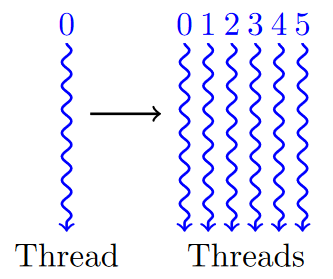
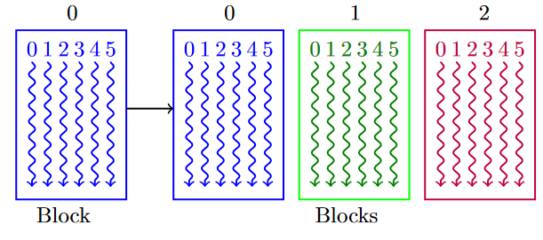
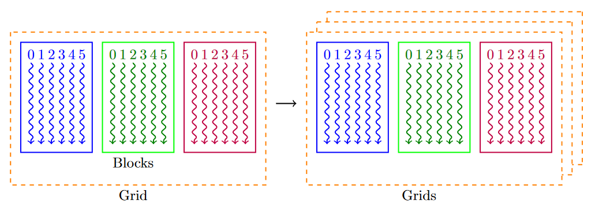
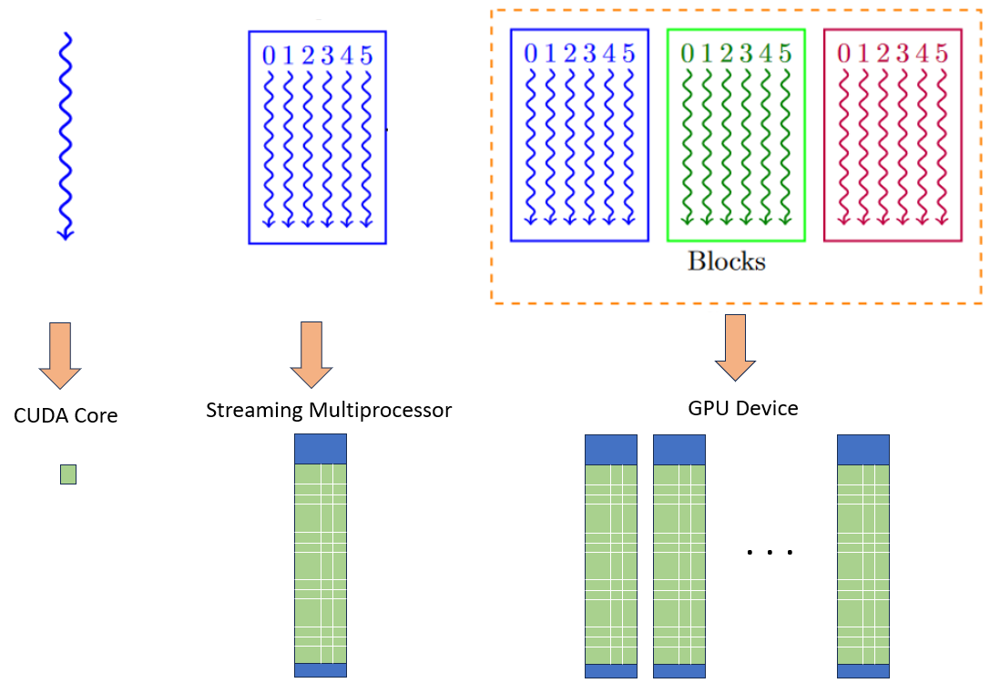
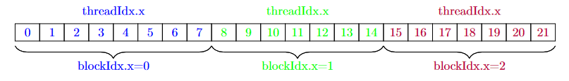
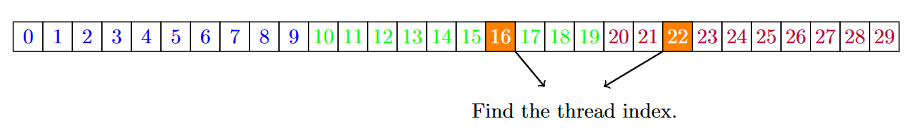
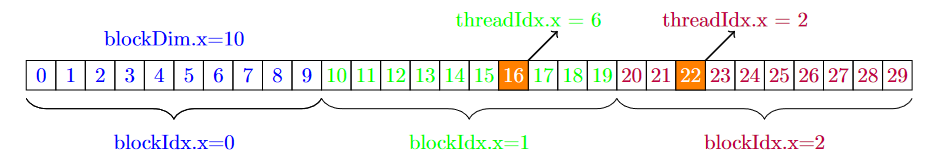

CUDA's parallel model: Threads,Blocks and Grids.
================================================

Device Code definition
----------------------

.. code-block:: cuda

   __global__ void kernel_function (void) {
   
   ## A function that can be run on each of the threads. 
   }

- CUDA C++ keyword ``__global__`` indicates that a function will be run on the device (GPU).
- This is also called from the host (CPU).
- nvcc (the CUDA compiler), can differntiate between which code will be executed on GPU and whill will be on CPU due to this nomenclature.   

Launching a CUDA Kernel
-----------------------

The next thing to know is how can we define that the above ``__global__`` function can be run in parallel. This is done with the kernel definition within the ``<<< >>>`` blocks as shown in the example. When launching a CUDA kernel, you define threads, blocks, and grids using the following syntax:

.. code-block:: cuda

   kernel_function<<<num_blocks, threads_per_block>>>(arguments);

- ``kernel_function``: This is the name of the CUDA kernel function you want to execute.
- ``num_blocks``: This is the number of blocks in the grid. It can be a one-dimensional, two-dimensional, or three-dimensional grid, specified as ``dim3`` type.
- ``threads_per_block``: This is the number of threads in each block. Similar to ``num_blocks``, it can be specified as ``dim3`` type.
- ``arguments``: These are the arguments passed to the CUDA kernel function.

For example:

.. code-block:: cuda

   dim3 num_blocks(64, 1, 1);
   dim3 threads_per_block(256, 1, 1);
   kernel_function<<<num_blocks, threads_per_block>>>(arguments); // kernel function will be executed 64 * 256 = 16384, times.

In this example, the kernel function will be executed with a grid of 64 blocks, each containing 256 threads. The total number of threads executing the kernel function will be ``64 * 256 = 16384`` threads. 

In CUDA programming, understanding threads, blocks, and grids is fundamental as they are key concepts for parallel execution on the GPU. Let's break down each of them:

Thread
------

- A thread is the smallest unit of execution in a CUDA program.
- Threads execute a specific portion of code, typically referred to as a kernel function.
- Each thread has its unique identifier called a thread index. 

Block
-----

- A block is a group of threads that execute the same code in parallel.
- Threads within a block can communicate and synchronize with each other using shared memory.
- Each block has its unique identifier called a block index.

Grid
----

- A grid is a collection of blocks that execute the same kernel function.
- Blocks within a grid can execute independently and concurrently.
- Each block within a grid can have its unique thread configuration.

Corresponding to a hardware, one can see from the following figure, that these are mapped respectively to a CUDA core, a streaming multiprocessor (SMs) and a GPU device respectively,

To understand thread and block indexing better, look at the following image, 

Here, three blocks have been shown, each with 7 threads. 

.. code-block:: bash

   int thread_index = threadIdx.x  + blockIdx.x * blockDim.x

With this formula, any thread in any number of grids can be easily identified. Now lets try an example, with this forumla. 

Which thread will operate on the 16th and 22nd element?

Take your time before you scroll. The answer can be adjudged from below. 

.. code-block:: cpp

   //obtained from threadIdx.x + blockIdx.x * blockDim.x 
   int answer_index_16 = 6 + 1*10  // = 16 
   int answer_index_22 = 2 + 2*10  // = 22 

It is important to note the threads being a multiple of 32 (Warp size). This is mostly intended for performance benefits.  i.e. the ``threads_per_block`` needs to be a multiple of 32 (but not greater than 1024) , while the number of blocks can be a big number, See Maximum number of threads per block and Maximum dimension size of grid size (x) from device querry :ref:`NVIDIA A100 card properties`. 
Now of course, it is not always possible to run the exact number of grids that are multiple of 32, say like 1000 parallel tasks. This can be achieved with the following forumula. 

.. code-block:: cpp

   int N = 100000;

   // Assume we have a desire to set 'threads_per_block' exactly to '1024', the largest possible threads_per_block for A100 cards. 
   size_t threads_per_block = 1024;

   // Ensure there are at least 'N' threads in the grid, but only 1 block's worth extra
   size_t number_of_blocks = (N + threads_per_block - 1) / threads_per_block;

   my_awesome_kernel_function<<<number_of_blocks, threads_per_block>>>(N);

Obtaining threads and blocks in CUDA
------------------------------------

See the following example that writes a simple print statement to identify the blocks, and threads of the kernels.

.. tabs::

   .. code-tab:: cuda

             #include <cstdio>
             /**
             * This function prints the blockdim, blockId and thread ID of the kernel. 
             */ 

             __global__ void print_id() {
                  int i = threadIdx.x + blockIdx.x*blockDim.x;

                  printf("blockDim.x = %d, blockIdx.x = %d, threadIdx.x = %d, of threadID i = %d\n", blockDim.x, blockIdx.x, threadIdx.x, i);
            }

             int main() { 

                  print_id<<<2,8>>>(); // try changing the numbers, to understand the indexing better. 
                  cudaDeviceSynchronize();
                  return 0;
             }

   .. code-tab:: make

         # Compiler options
         NVCC = nvcc
         GENCODE = -gencode arch=compute_80,code=sm_80

         # Target executable
         TARGET = err.out

         # Source files #This is the name of the saved code. Change this if you change the file name.
         SRCS = error_handling.cpp

         # Rule to build the executable
         $(TARGET): $(SRCS)
                 $(NVCC) $(SRCS) -o $(TARGET) $(GENCODE)

         # Clean rule
         clean:
                 rm -f $(TARGET)

   .. code-tab:: slurm

         #!/bin/bash
         #SBATCH --nodes=1 
         #SBATCH --job-name=threads
         #SBATCH --time=00:10:00
         #SBATCH --partition=ampere-mq     
         #SBATCH --gres=gpu:1

         module load cuda-12.2.2
         module load gcc-uoneasy/8.3.0

         make
         
         #The executable will be named after the "-o" flag in the #TARGET variable inside makefile. 
         ./err.out 

   .. code-tab:: bash Solution

         blockDim.x = 8, blockIdx.x = 1, threadIdx.x = 0, of threadID i = 8
         blockDim.x = 8, blockIdx.x = 1, threadIdx.x = 1, of threadID i = 9
         blockDim.x = 8, blockIdx.x = 1, threadIdx.x = 2, of threadID i = 10
         blockDim.x = 8, blockIdx.x = 1, threadIdx.x = 3, of threadID i = 11
         blockDim.x = 8, blockIdx.x = 1, threadIdx.x = 4, of threadID i = 12
         blockDim.x = 8, blockIdx.x = 1, threadIdx.x = 5, of threadID i = 13
         blockDim.x = 8, blockIdx.x = 1, threadIdx.x = 6, of threadID i = 14
         blockDim.x = 8, blockIdx.x = 1, threadIdx.x = 7, of threadID i = 15
         blockDim.x = 8, blockIdx.x = 0, threadIdx.x = 0, of threadID i = 0
         blockDim.x = 8, blockIdx.x = 0, threadIdx.x = 1, of threadID i = 1
         blockDim.x = 8, blockIdx.x = 0, threadIdx.x = 2, of threadID i = 2
         blockDim.x = 8, blockIdx.x = 0, threadIdx.x = 3, of threadID i = 3
         blockDim.x = 8, blockIdx.x = 0, threadIdx.x = 4, of threadID i = 4
         blockDim.x = 8, blockIdx.x = 0, threadIdx.x = 5, of threadID i = 5
         blockDim.x = 8, blockIdx.x = 0, threadIdx.x = 6, of threadID i = 6
         blockDim.x = 8, blockIdx.x = 0, threadIdx.x = 7, of threadID i = 7

3D grids and blocks
-------------------

One can also potentially define a 3D grids as shown in above figures, with the help of a built-in ``struct`` by the name of ``dim3 (x,y,z)``. See the example below. 

.. tabs::

  .. code-tab:: cuda

         #include <cuda_runtime_api.h>
         #include <iostream>

         __global__ void PrintIDs()
         {
            // Use built-in variables blockIdx and threadIdx
            const auto tID = threadIdx;
            const auto bID = blockIdx;
            printf("Block Id: %d,%d - Thread Id: %d,%d\n", bID.x, bID.y, tID.x, tID.y);
         }

         int main()
         {
            std::cout << "==== 3D Grid Configurations ====\n" << std::endl;

            std::cout << "Small grid: \n";
            // Configure the grid and block dimensions via built-in struct dim3 (X,Y,Z)
            const dim3 gridSize_small{ 1, 1, 1 };
            const dim3 blockSize_small{ 4, 4, 1 };

            // Launch kernel with custom grid
            PrintIDs<<<gridSize_small, blockSize_small>>>();

            // Need to synchronize here to have the GPU and CPU printouts in the correct order
            cudaDeviceSynchronize();

            std::cout << "\nLarger grid: \n";
            const dim3 gridSize_large{ 2, 2, 1 }; // try and change these numbers
            const dim3 blockSize_large{ 16, 16, 1 }; // try and change these numbers

            PrintIDs<<<gridSize_large, blockSize_large >>>();
            cudaDeviceSynchronize();

            return 0;
         }

  .. code-tab:: make
         
         NVCC = nvcc
         GENCODE = -gencode arch=compute_80,code=sm_80

         # Target executable
         TARGET = 3dgrids.out

         # Source files #This is the name of the saved code. Change this if you change the file name.
         SRCS = 3dthreads_n_blocks.cu

         # Rule to build the executable
         $(TARGET): $(SRCS)
               $(NVCC) $(SRCS) -o $(TARGET) $(GENCODE)

         # Clean rule # This shoudl be tabbed spaced, correct if throws an error.
         clean:
               rm -f $(TARGET)

  .. code-tab:: slurm

         #!/bin/bash
         #SBATCH --nodes=1 
         #SBATCH --job-name=3dgrids
         #SBATCH --time=00:10:00
         #SBATCH --partition=ampere-mq     
         #SBATCH --gres=gpu:1

         module load cuda-12.2.2
         module load gcc-uoneasy/8.3.0

         make
         # uncomment the line below and comment make, if you want to compile without the makefile and make command.
         ###vcc 3dthreads_n_blocks.cu -o 3dgrids.out -gencode arch=compute_80,code=sm_80
         
         #The executable will be named after the "-o" flag in the #TARGET variable inside makefile. 
         ./3dgrids.out

  .. code-tab:: bash Solution

         ==== 3D Grid Configurations ====

         Small grid:
         Block Id: 0,0 - Thread Id: 0,0
         Block Id: 0,0 - Thread Id: 1,0
         Block Id: 0,0 - Thread Id: 2,0
         Block Id: 0,0 - Thread Id: 3,0
         Block Id: 0,0 - Thread Id: 0,1
         Block Id: 0,0 - Thread Id: 1,1
         Block Id: 0,0 - Thread Id: 2,1
         Block Id: 0,0 - Thread Id: 3,1
         Block Id: 0,0 - Thread Id: 0,2
         Block Id: 0,0 - Thread Id: 1,2
         Block Id: 0,0 - Thread Id: 2,2
         Block Id: 0,0 - Thread Id: 3,2
         Block Id: 0,0 - Thread Id: 0,3
         Block Id: 0,0 - Thread Id: 1,3
         Block Id: 0,0 - Thread Id: 2,3
         Block Id: 0,0 - Thread Id: 3,3

         Larger grid:
         Block Id: 0,0 - Thread Id: 0,10
         Block Id: 0,0 - Thread Id: 1,10
         Block Id: 0,0 - Thread Id: 2,10
         Block Id: 0,0 - Thread Id: 3,10
         Block Id: 0,0 - Thread Id: 4,10
         Block Id: 0,0 - Thread Id: 5,10
         Block Id: 0,0 - Thread Id: 6,10
         Block Id: 0,0 - Thread Id: 7,10
         Block Id: 0,0 - Thread Id: 8,10
         Block Id: 0,0 - Thread Id: 9,10
         Block Id: 0,0 - Thread Id: 10,10
         Block Id: 0,0 - Thread Id: 11,10
         Block Id: 0,0 - Thread Id: 12,10
         Block Id: 0,0 - Thread Id: 13,10
         Block Id: 0,0 - Thread Id: 14,10
         Block Id: 0,0 - Thread Id: 15,10
         Block Id: 0,0 - Thread Id: 0,11
         Block Id: 0,0 - Thread Id: 1,11
         Block Id: 0,0 - Thread Id: 2,11
         Block Id: 0,0 - Thread Id: 3,11
         Block Id: 0,0 - Thread Id: 4,11
         Block Id: 0,0 - Thread Id: 5,11
         Block Id: 0,0 - Thread Id: 6,11
         Block Id: 0,0 - Thread Id: 7,11
         Block Id: 0,0 - Thread Id: 8,11
         Block Id: 0,0 - Thread Id: 9,11
         Block Id: 0,0 - Thread Id: 10,11
         Block Id: 0,0 - Thread Id: 11,11
         Block Id: 0,0 - Thread Id: 12,11
         Block Id: 0,0 - Thread Id: 13,11
         Block Id: 0,0 - Thread Id: 14,11
         Block Id: 0,0 - Thread Id: 15,11
         Block Id: 0,0 - Thread Id: 0,8
         Block Id: 0,0 - Thread Id: 1,8
         Block Id: 0,0 - Thread Id: 2,8
         Block Id: 0,0 - Thread Id: 3,8
         Block Id: 0,0 - Thread Id: 4,8
         Block Id: 0,0 - Thread Id: 5,8
         Block Id: 0,0 - Thread Id: 6,8
         Block Id: 0,0 - Thread Id: 7,8
         Block Id: 0,0 - Thread Id: 8,8
         Block Id: 0,0 - Thread Id: 9,8
         Block Id: 0,0 - Thread Id: 10,8
         Block Id: 0,0 - Thread Id: 11,8
         Block Id: 0,0 - Thread Id: 12,8
         Block Id: 0,0 - Thread Id: 13,8
         Block Id: 0,0 - Thread Id: 14,8
         Block Id: 0,0 - Thread Id: 15,8
         Block Id: 0,0 - Thread Id: 0,9
         Block Id: 0,0 - Thread Id: 1,9
         Block Id: 0,0 - Thread Id: 2,9
         Block Id: 0,0 - Thread Id: 3,9
         Block Id: 0,0 - Thread Id: 4,9
         Block Id: 0,0 - Thread Id: 5,9
         Block Id: 0,0 - Thread Id: 6,9
         Block Id: 0,0 - Thread Id: 7,9
         Block Id: 0,0 - Thread Id: 8,9
         Block Id: 0,0 - Thread Id: 9,9
         Block Id: 0,0 - Thread Id: 10,9
         Block Id: 0,0 - Thread Id: 11,9
         Block Id: 0,0 - Thread Id: 12,9
         Block Id: 0,0 - Thread Id: 13,9
         Block Id: 0,0 - Thread Id: 14,9
         Block Id: 0,0 - Thread Id: 15,9
         Block Id: 0,0 - Thread Id: 0,0
         Block Id: 0,0 - Thread Id: 1,0
         Block Id: 0,0 - Thread Id: 2,0
         Block Id: 0,0 - Thread Id: 3,0
         Block Id: 0,0 - Thread Id: 4,0
         Block Id: 0,0 - Thread Id: 5,0
         Block Id: 0,0 - Thread Id: 6,0
         Block Id: 0,0 - Thread Id: 7,0
         Block Id: 0,0 - Thread Id: 8,0
         Block Id: 0,0 - Thread Id: 9,0
         Block Id: 0,0 - Thread Id: 10,0
         Block Id: 0,0 - Thread Id: 11,0
         Block Id: 0,0 - Thread Id: 12,0
         Block Id: 0,0 - Thread Id: 13,0
         Block Id: 0,0 - Thread Id: 14,0
         Block Id: 0,0 - Thread Id: 15,0
         Block Id: 0,0 - Thread Id: 0,1
         Block Id: 0,0 - Thread Id: 1,1
         Block Id: 0,0 - Thread Id: 2,1
         Block Id: 0,0 - Thread Id: 3,1
         Block Id: 0,0 - Thread Id: 4,1
         Block Id: 0,0 - Thread Id: 5,1
         Block Id: 0,0 - Thread Id: 6,1
         Block Id: 0,0 - Thread Id: 7,1
         Block Id: 0,0 - Thread Id: 8,1
         Block Id: 0,0 - Thread Id: 9,1
         Block Id: 0,0 - Thread Id: 10,1
         Block Id: 0,0 - Thread Id: 11,1
         Block Id: 0,0 - Thread Id: 12,1
         Block Id: 0,0 - Thread Id: 13,1
         Block Id: 0,0 - Thread Id: 14,1
         Block Id: 0,0 - Thread Id: 15,1
         Block Id: 0,0 - Thread Id: 0,12
         Block Id: 0,0 - Thread Id: 1,12
         Block Id: 0,0 - Thread Id: 2,12
         Block Id: 0,0 - Thread Id: 3,12
         Block Id: 0,0 - Thread Id: 4,12
         Block Id: 0,0 - Thread Id: 5,12
         Block Id: 0,0 - Thread Id: 6,12
         Block Id: 0,0 - Thread Id: 7,12
         Block Id: 0,0 - Thread Id: 8,12
         Block Id: 0,0 - Thread Id: 9,12
         Block Id: 0,0 - Thread Id: 10,12
         Block Id: 0,0 - Thread Id: 11,12
         Block Id: 0,0 - Thread Id: 12,12
         Block Id: 0,0 - Thread Id: 13,12
         Block Id: 0,0 - Thread Id: 14,12
         Block Id: 0,0 - Thread Id: 15,12
         Block Id: 0,0 - Thread Id: 0,13
         Block Id: 0,0 - Thread Id: 1,13
         Block Id: 0,0 - Thread Id: 2,13
         Block Id: 0,0 - Thread Id: 3,13
         Block Id: 0,0 - Thread Id: 4,13
         Block Id: 0,0 - Thread Id: 5,13
         Block Id: 0,0 - Thread Id: 6,13
         Block Id: 0,0 - Thread Id: 7,13
         Block Id: 0,0 - Thread Id: 8,13
         Block Id: 0,0 - Thread Id: 9,13
         Block Id: 0,0 - Thread Id: 10,13
         Block Id: 0,0 - Thread Id: 11,13
         Block Id: 0,0 - Thread Id: 12,13
         Block Id: 0,0 - Thread Id: 13,13
         Block Id: 0,0 - Thread Id: 14,13
         Block Id: 0,0 - Thread Id: 15,13
         Block Id: 0,0 - Thread Id: 0,6
         Block Id: 0,0 - Thread Id: 1,6
         Block Id: 0,0 - Thread Id: 2,6
         Block Id: 0,0 - Thread Id: 3,6
         Block Id: 0,0 - Thread Id: 4,6
         Block Id: 0,0 - Thread Id: 5,6
         Block Id: 0,0 - Thread Id: 6,6
         Block Id: 0,0 - Thread Id: 7,6
         Block Id: 0,0 - Thread Id: 8,6
         Block Id: 0,0 - Thread Id: 9,6
         Block Id: 0,0 - Thread Id: 10,6
         Block Id: 0,0 - Thread Id: 11,6
         Block Id: 0,0 - Thread Id: 12,6
         Block Id: 0,0 - Thread Id: 13,6
         Block Id: 1,1 - Thread Id: 14,6
         Block Id: 1,1 - Thread Id: 15,6
         Block Id: 1,1 - Thread Id: 0,7
         Block Id: 1,1 - Thread Id: 1,7
         Block Id: 1,1 - Thread Id: 2,7
         Block Id: 1,1 - Thread Id: 3,7
         Block Id: 1,1 - Thread Id: 4,7
         Block Id: 1,1 - Thread Id: 5,7
         Block Id: 1,1 - Thread Id: 6,7
         Block Id: 1,1 - Thread Id: 7,7
         Block Id: 1,1 - Thread Id: 8,7
         Block Id: 1,1 - Thread Id: 9,7
         Block Id: 1,1 - Thread Id: 10,7
         Block Id: 1,1 - Thread Id: 11,7
         Block Id: 1,1 - Thread Id: 12,7
         Block Id: 1,1 - Thread Id: 13,7
         Block Id: 1,1 - Thread Id: 14,7
         Block Id: 1,1 - Thread Id: 15,7
         Block Id: 1,1 - Thread Id: 0,8
         Block Id: 1,1 - Thread Id: 1,8
         Block Id: 1,1 - Thread Id: 2,8
         Block Id: 1,1 - Thread Id: 3,8
         Block Id: 1,1 - Thread Id: 4,8
         Block Id: 1,1 - Thread Id: 5,8
         Block Id: 1,1 - Thread Id: 6,8
         Block Id: 1,1 - Thread Id: 7,8
         Block Id: 1,1 - Thread Id: 8,8
         Block Id: 1,1 - Thread Id: 9,8
         Block Id: 1,1 - Thread Id: 10,8
         Block Id: 1,1 - Thread Id: 11,8
         Block Id: 1,1 - Thread Id: 12,8
         Block Id: 1,1 - Thread Id: 13,8
         Block Id: 1,1 - Thread Id: 14,8
         Block Id: 1,1 - Thread Id: 15,8
         Block Id: 1,1 - Thread Id: 0,9
         Block Id: 1,1 - Thread Id: 1,9
         Block Id: 1,1 - Thread Id: 2,9
         Block Id: 1,1 - Thread Id: 3,9
         Block Id: 1,1 - Thread Id: 4,9
         Block Id: 1,1 - Thread Id: 5,9
         Block Id: 1,1 - Thread Id: 6,9
         Block Id: 1,1 - Thread Id: 7,9
         Block Id: 1,1 - Thread Id: 8,9
         Block Id: 1,1 - Thread Id: 9,9
         Block Id: 1,1 - Thread Id: 10,9
         Block Id: 1,1 - Thread Id: 11,9
         Block Id: 1,1 - Thread Id: 12,9
         Block Id: 1,1 - Thread Id: 13,9
         Block Id: 1,1 - Thread Id: 14,9
         Block Id: 1,1 - Thread Id: 15,9
         Block Id: 1,1 - Thread Id: 0,10
         Block Id: 1,1 - Thread Id: 1,10
         Block Id: 1,1 - Thread Id: 2,10
         Block Id: 1,1 - Thread Id: 3,10
         Block Id: 1,1 - Thread Id: 4,10
         Block Id: 0,1 - Thread Id: 5,10
         Block Id: 0,1 - Thread Id: 6,10
         Block Id: 0,1 - Thread Id: 7,10
         Block Id: 0,1 - Thread Id: 8,10
         Block Id: 0,1 - Thread Id: 9,10
         Block Id: 0,1 - Thread Id: 10,10
         Block Id: 0,1 - Thread Id: 11,10
         Block Id: 0,1 - Thread Id: 12,10
         Block Id: 0,1 - Thread Id: 13,10
         Block Id: 0,1 - Thread Id: 14,10
         Block Id: 0,1 - Thread Id: 15,10
         Block Id: 0,1 - Thread Id: 0,11
         Block Id: 0,1 - Thread Id: 1,11
         Block Id: 0,1 - Thread Id: 2,11
         Block Id: 0,1 - Thread Id: 3,11
         Block Id: 0,1 - Thread Id: 4,11
         Block Id: 0,1 - Thread Id: 5,11
         Block Id: 0,1 - Thread Id: 6,11
         Block Id: 0,1 - Thread Id: 7,11
         Block Id: 0,1 - Thread Id: 8,11
         Block Id: 0,1 - Thread Id: 9,11
         Block Id: 0,1 - Thread Id: 10,11
         Block Id: 0,1 - Thread Id: 11,11
         Block Id: 0,1 - Thread Id: 12,11
         Block Id: 0,1 - Thread Id: 13,11
         Block Id: 0,1 - Thread Id: 14,11
         Block Id: 0,1 - Thread Id: 15,11

As to answer the question of how much is the maximum number of threads and grids can be chosen for the size, the following sciprt of deviceQuery from NVIDIA's cuda samples, gives a brief about the A100 card, from :ref:`NVIDIA A100 card properties`.

