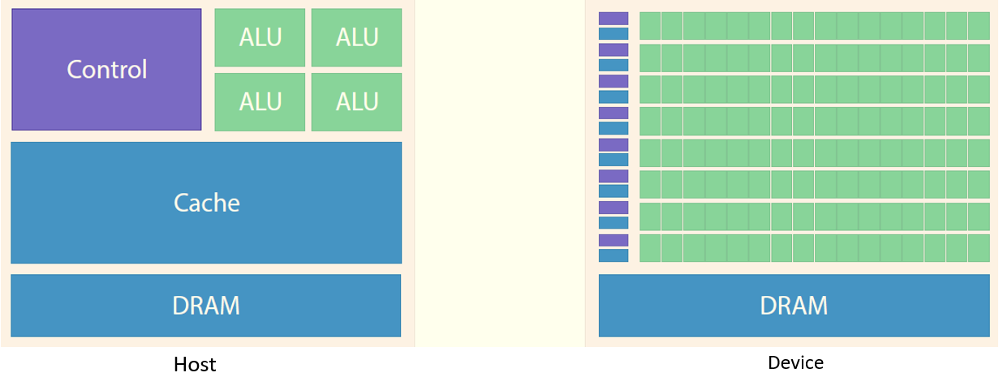
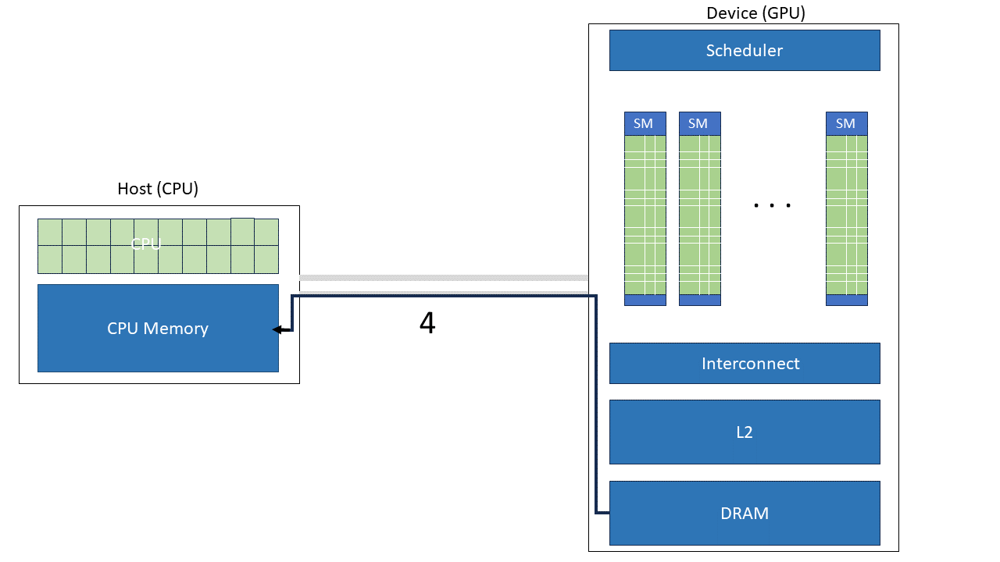

.. CUDA on ADA documentation master file, created by
   sphinx-quickstart on Tue Mar  5 13:12:55 2024.
   You can adapt this file completely to your liking, but it should at least
   contain the root `toctree` directive.

Welcome to CUDA on ADA's documentation!
=======================================

This documentaion will cover the basics of GPU and CUDA (C/c++) for users to efficiently use the GPU hardware currently available on ADA. 

Chapters
========

The documentation covers the following aspects of CUDA and GPU programming.

.. toctree::

    01Helloworld
    02cudaparallel
    03mem_mgmt
    04errorhandling
    05usinglibs
    06tips&tricks

What is a GPU?
==============

Graphics Processing unit better known as GPU were originally designed for image manipulation on a computer screen. GPUs, or graphics processing units, were originally used to process data for computer displays. As time evolved, GPUs became powerful enough to accelarate scientific computing. 

GPUs are almost always used along with CPUs where the main function of a program is being run by the CPU while specific computation intensive functions assigned to the GPU.

Hardware wise, a CPU as in a laptop or desktop system may have 8-12 to 24 CPU cores, however, a GPU can go to thousands of processors, all of which can be utilized in parallel with help of some programming. 
The domains of machine learning, neural networks and solving differential equations etc, specifically benefit from a GPU hardware resource as this can significantly outperform a traditional CPU. 

The above image also gives an intutive comparison when a computation (passenger) needs to be performed (commuted).

Lastly, like a CPU, a GPU has separate structures for execution units and memory. This simply means that the process flows for using GPUs is defined differently as follows. 

What problems can be solved by using GPUs?
==========================================

Look at the detailed thread on `stack exchange <https://scicomp.stackexchange.com/questions/943/what-kinds-of-problems-lend-themselves-well-to-gpu-computing>`_.
The insight as 

*From a metaphorical point of view, the GPU can be seen as a person lying on a bed of nails. The person lying on top is the data and in the base of each nail there is a processor, so the nail is actually an arrow pointing from processor to memory. All nails are in a regular pattern, like a grid. If the body is well spread, it feels good (performance is good), if the body only touches some spots of the nail bed, then the pain is bad (bad performance).*

In general, whenever large amounts of data prallelism is involved, a GPU can be useful. 

- Large scale Matrix/Vector operations: Image processing, scientific computations and machine learning. 
- Fourier transforms. Also common in machine learning, scientific computing, and image processing.
- Monte Carlo simulations: Used across finance, physics, and other fields to simulate complex systems.
- Molecular dynamics simulations: Used in chemistry, biochemistry and physics.
- Computational fluid dynamics: Used in engineering, physics, and other fields.
- Convolutional neural networks and computer vision algorithms.
- Big data analytics: Clustering, classification, regression, etc.
- Graphics rendering: Original use-case for GPUs.

Overview of using GPU programs
==============================

The following steps give a brief of how GPU programs work (or should be written).

1. Copy data from CPU memory to GPU memory.
2. Transfer program. (The code that tells the processors of what to do with the device memory.)
3. Load the GPU program , execute on streaming processors (SMs), get cached data from device (GPU) memory; write back the results.
4. Copy the results back to the host memory.

.. figure:: images/step3.png

GPU Resources at University of Nottingham
=========================================

Partitions
----------

See the `Partitions link <https://uniofnottm.sharepoint.com/sites/DigitalResearch/SitePages/Ada-Commands-Partitions-and-Resources.aspx#partitions>`_ to look at the various hardware resources available for HPC jobs at University of Nottingham.

There are 3 GPU partitions on this list. Namely, 

+----------------------+-----------------------------------------------------+
| GPU partitions       | Properties                                          |
+======================+=====================================================+
| ampereq              | no permissions                                      |
+----------------------+-----------------------------------------------------+
| ampere-devq          | execute                                             |
+----------------------+-----------------------------------------------------+
| ampere-mq            | write                                               |
+----------------------+-----------------------------------------------------+

NVIDIA A100 card properties
---------------------------

As all of these partitions contain the current state-of-the-art NVIDIA A100 cards, they all have the following properties. (obtained from deviceQuerry present in `CUDA samples <https://github.com/NVIDIA/cuda-samples>`_)

.. code-block:: bash

   CUDA Device Query (Runtime API) version (CUDART static linking)
   Detected 1 CUDA Capable device(s)

   Device 0: "NVIDIA A100 80GB PCIe MIG 1g.10gb"
   CUDA Driver Version / Runtime Version          12.3 / 12.1
   CUDA Capability Major/Minor version number:    8.0
   Total amount of global memory:                 9728 MBytes (10200547328 bytes)
   MapSMtoCores for SM 8.0 is undefined.  Default to use 64 Cores/SM
   MapSMtoCores for SM 8.0 is undefined.  Default to use 64 Cores/SM
   (14) Multiprocessors, ( 64) CUDA Cores/MP:     896 CUDA Cores
   GPU Max Clock rate:                            1410 MHz (1.41 GHz)
   Memory Clock rate:                             1512 Mhz
   Memory Bus Width:                              640-bit
   L2 Cache Size:                                 5242880 bytes
   Maximum Texture Dimension Size (x,y,z)         1D=(131072), 2D=(131072, 65536), 3D=(16384, 16384, 16384)
   Maximum Layered 1D Texture Size, (num) layers  1D=(32768), 2048 layers
   Maximum Layered 2D Texture Size, (num) layers  2D=(32768, 32768), 2048 layers
   Total amount of constant memory:               65536 bytes
   Total amount of shared memory per block:       49152 bytes
   Total number of registers available per block: 65536
   Warp size:                                     32
   Maximum number of threads per multiprocessor:  2048
   Maximum number of threads per block:           1024
   Max dimension size of a thread block (x,y,z): (1024, 1024, 64)
   Max dimension size of a grid size    (x,y,z): (2147483647, 65535, 65535)
   Maximum memory pitch:                          2147483647 bytes
   Texture alignment:                             512 bytes
   Concurrent copy and kernel execution:          Yes with 1 copy engine(s)
   Run time limit on kernels:                     No
   Integrated GPU sharing Host Memory:            No
   Support host page-locked memory mapping:       Yes
   Alignment requirement for Surfaces:            Yes
   Device has ECC support:                        Enabled
   Device supports Unified Addressing (UVA):      Yes
   Device supports Compute Preemption:            Yes
   Supports Cooperative Kernel Launch:            Yes
   Supports MultiDevice Co-op Kernel Launch:      Yes
   Device PCI Domain ID / Bus ID / location ID:   0 / 1 / 0
   Compute Mode:
      < Default (multiple host threads can use ::cudaSetDevice() with device simultaneously) >

   deviceQuery, CUDA Driver = CUDART, CUDA Driver Version = 12.3, CUDA Runtime Version = 12.1, NumDevs = 1
   Result = PASS

While the CPU properties on these nodes is as follows, 

.. code-block:: bash

   Architecture:        x86_64
   CPU op-mode(s):      32-bit, 64-bit
   Byte Order:          Little Endian
   CPU(s):              96
   On-line CPU(s) list: 0-95
   Thread(s) per core:  1
   Core(s) per socket:  48
   Socket(s):           2
   NUMA node(s):        16
   Vendor ID:           AuthenticAMD
   CPU family:          25
   Model:               17
   Model name:          AMD EPYC 9454 48-Core Processor
   Stepping:            1
   CPU MHz:             2750.000
   CPU max MHz:         3810.7910
   CPU min MHz:         1500.0000
   BogoMIPS:            5492.04
   Virtualization:      AMD-V
   L1d cache:           32K
   L1i cache:           32K
   L2 cache:            1024K
   L3 cache:            32768K
   NUMA node0 CPU(s):   0-5
   NUMA node1 CPU(s):   6-11
   NUMA node2 CPU(s):   12-17
   NUMA node3 CPU(s):   18-23
   NUMA node4 CPU(s):   24-29
   NUMA node5 CPU(s):   30-35
   NUMA node6 CPU(s):   36-41
   NUMA node7 CPU(s):   42-47
   NUMA node8 CPU(s):   48-53
   NUMA node9 CPU(s):   54-59
   NUMA node10 CPU(s):  60-65
   NUMA node11 CPU(s):  66-71
   NUMA node12 CPU(s):  72-77
   NUMA node13 CPU(s):  78-83
   NUMA node14 CPU(s):  84-89
   NUMA node15 CPU(s):  90-95

Feel free to inquire about other GPU related properties through the command,

``nvidia-smi -q | less``

Finally, a streaming multiprocessor or SM's configuration for the A100 card is shown below. 

.. figure:: images/A100arch.png
   :align: center
   :alt: Your image alt text

   Diagram of streaming multiprocessor for `NVIDIA A100 GPU <https://developer.nvidia.com/blog/nvidia-ampere-architecture-in-depth/>`_ card.

Another important feature that is useful while writing/compiling CUDA programs is the compute_capability of the hardware, which in case of A100s, is 8.0. This can be obtained from the ``nvcc --help`` command after loading the cuda module with ``module load cuda/12.2.2``. This will also become more clear with examples. 

.. toctree::
   :maxdepth: 2
   :caption: Contents:

